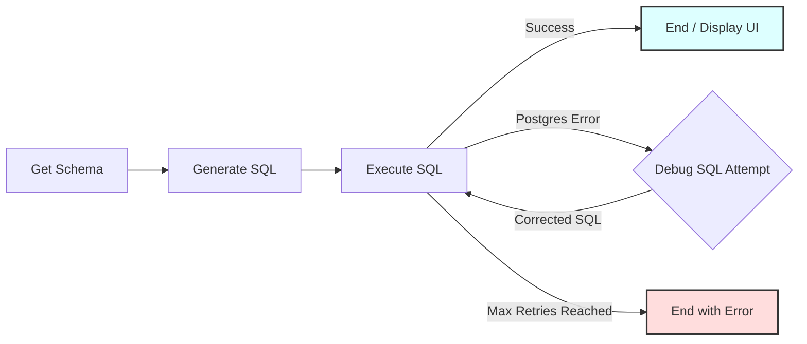

# Text-to-SQL Workflow

A PocketFlow example demonstrating a text-to-SQL workflow that converts natural language questions into executable SQL queries for an SQLite database, including an LLM-powered debugging loop for failed queries.

- Check out the [Substack Post Tutorial](https://zacharyhuang.substack.com/p/text-to-sql-from-scratch-tutorial) for more!

-   **Schema Awareness**: Automatically retrieves the **PostgreSQL** schema to provide context to the LLM.
-   **LLM-Powered SQL Generation**: Uses **Google Gemini 1.5 Flash** to translate natural language questions (Vietnamese/English) into SQL queries (using YAML structured output).
-   **Automated Debugging Loop**: If SQL execution fails, the LLM attempts to correct the query based on the error message. This process repeats up to a configurable number of times.
-   **Interactive UI**: A Streamlit-based chat interface to query the database and visualize results.

## Getting Started

1.  **Install Packages:**
    Install the required Python libraries.
    ```bash
    pip install -r requirements.txt
    pip install psycopg2-binary google-generativeai streamlit pandas sqlalchemy
    ```

2.  **Database Setup (PostgreSQL):**
    * Ensure you have PostgreSQL installed and running.
    * Create a database named `baogia_db`.
    * Check the `DB_CONFIG` in `import_data.py` and `nodes.py`. Default credentials are:
        * User: `postgres`
        * Password: `12345`
        * Host: `localhost`
    * **Import Data (ETL Pipeline)**: Place your source data (e.g., `Lich_Su_Bao_Gia.csv`) in the root folder and run the import script.
    ```bash
    python import_data.py
    ```
    *This script acts as an ETL tool, cleaning and loading your CSV data into the PostgreSQL `lich_su_bao_gia` table. You can customize this script to load other datasets.*

3.  **Set API Key:**
    Update `call_llm.py` with your Google Gemini API Key, or set it directly in the code:
    ```python
    GEMINI_API_KEY = "your_api_key" 
    ```

4.  **Run the Application:**
    Start the Streamlit web interface.
    ```bash
    streamlit run app.py
    ```

## How It Works

The workflow uses several nodes connected in a sequence, with a feedback loop for debugging failed SQL queries.




**Node Descriptions:**

1.  **`GetSchema`**: 
    - **Purpose**: To dynamically map the PostgreSQL database structure.
    
    - **Type**: Regular
    
    - **Step**:
    - `prep`: Returns None.
    - `exec`: Queries `information_schema.columns` for `table_schema = 'public'`. Formats all tables and columns into a readable string.
    - `post`: Stores `schema` in shared store.
    - `Scalability Note`: This node captures any new tables (e.g., `materials`, `contracts`) added via the import pipeline without code changes.
            
2.  **`GenerateSQL`**: 
    - **Purpose**: To reason and generate valid PostgreSQL syntax.
    - **Type**: Regular
    - **Steps**:
    - `prep`: Fetches `natural_query` and the full `schema`.
    - `exec`: Prompts LLM to generate SQL. Enforces strict YAML output format.
    - `post`: Updates `generated_sql`. Resets retry counter.

3.  **`ExecuteSQL`**: 
    - **Purpose**: To interact with the PostgreSQL engine.
    - **Type**: Regular
    - **Steps**:
    - `prep`: Gets `generated_sql`.
    - `exec`: Executes query. Handles `SELECT` (fetch results) vs `INSERT/UPDATE` (commit). Catches `psycopg2.Error`.
    - `post`:
        - **Success**: Saves results and columns.
        - **Failure**: Saves error, increments counter. Returns `"error_retry"` if under limit, else `"failed"`.

4.  **`DebugSQL`**: 
    - **Purpose**: To analyze errors and fix SQL logic.
    - **Type**: Regular
    - **Steps**:
    - `prep`: Gets `natural_query`, `schema`, failed `generated_sql`, and `execution_error`.
    - `exec`: Asks LLM to fix the SQL based on the specific Postgres error message.
    - `post`: Updates `generated_sql` with the fix. Loops back to `ExecuteSQL`.


## Files

-   [`app.py`](./app.py): The Streamlit frontend application for chatting and visualizing data.
-   [`main.py`](./main.py): Backend entry point to run the flow logic.
-   [`flow.py`](./flow.py): Defines the PocketFlow structure, connecting nodes and the debug loop.
-   [`nodes.py`](./nodes.py): Contains the core logic classes (`GetSchema`, `GenerateSQL`, `ExecuteSQL`, `DebugSQL`) implementing PostgreSQL interactions.
-   [`import_data.py`](./import_data.py): Script to clean and import CSV data into PostgreSQL.
-   [`utils.py`](./utils.py): Utility function to handle API calls to Google Gemini.
-   [`pocketflow.py`](./pocketflow.py): The custom orchestration framework for managing the workflow.
-   [`Lich_Su_Bao_Gia.xlsx`](./Lich_Su_Bao_Gia.xlsx): Source data file (Quotation History).
-   [`requirements.txt`](./requirements.txt): Lists Python package dependencies.
-   [`README.md`](./README.md): This file.

## Example Output (Successful Run)

```
=== Starting Chatbot ===
Query: 'Top 3 dự án có giá trị lớn nhất'
==============================

===== DB SCHEMA =====
Table: lich_su_bao_gia
  - project_id (integer)
  - project_name (text)
  - building_type (text)
  - location (text)
  - total_value (double precision)
  - quotation_date (date)
  ...
=====================

===== GENERATED SQL =====
SELECT project_name, total_value 
FROM lich_su_bao_gia 
ORDER BY total_value DESC 
LIMIT 3;
=========================

===== RESULT =====
('Khu đô thị EcoPark', 8500000000.0)
('Nhà máy VinFast', 7200000000.0)
('Cao ốc Landmark 81', 5500000000.0)

=== Workflow Completed Successfully ===
```
