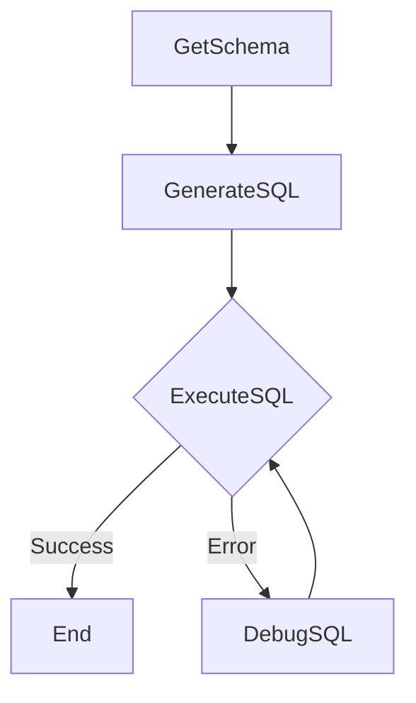

# Design Doc: Text-to-SQL Agent (PostgreSQL Version)

> Please DON'T remove notes for AI

## Requirements

> Notes for AI: Keep it simple and clear.
> If the requirements are abstract, write concrete user stories

The system is designed as a **Multi-source Data Intelligence Platform** for the construction domain. It should take a natural language query (Vietnamese) and:
1.  **Dynamic Schema Extraction**: Automatically extract schema information from the PostgreSQL database `baogia_db`. It should support not only the core `lich_su_bao_gia` table but be ready to recognize other tables (e.g., Materials, Personnel) dynamically.
2.  **SQL Generation**: Generate a PostgreSQL-compatible SQL query based on the user's question and the retrieved schema.
3.  **Execution**: Execute the query against the PostgreSQL database.
4.  **Self-Correction**: If execution fails (e.g., syntax error), enter a debugging loop where the AI analyzes the error and corrects the SQL automatically (up to a configured limit).
5.  **Result**: Return the final data results or an error message if the process fails.

## Flow Design

> Notes for AI:
> 1. Consider the design patterns of agent, map-reduce, rag, and workflow. Apply them if they fit.
> 2. Present a concise, high-level description of the workflow.

### Applicable Design Pattern:

The system follows an **Agentic Workflow** pattern with a **Self-Healing** mechanism.
-   **Workflow**: Sequential execution of schema retrieval, reasoning (SQL generation), and execution.
-   **Agent (Debugging)**: A feedback loop acts as a specialized agent that takes "Environment Feedback" (Postgres Error) to refine its "Action" (SQL Query).

### Flow high-level Design:

1.  **`GetSchema`**: Connects to `information_schema` to retrieve definitions for *all* public tables, ensuring the system is data-agnostic and scalable.
2.  **`GenerateSQL`**: Uses the LLM to translate natural language into PostgreSQL queries, utilizing the dynamic schema context.
3.  **`ExecuteSQL`**: Runs the query via `psycopg2`. Success leads to the end state. Failure triggers the `DebugSQL` node.
4.  **`DebugSQL`**: The "Repair Agent" that fixes broken SQL queries using the error log and original intent.



## Utility Functions

> Notes for AI:
> 1. Understand the utility function definition thoroughly by reviewing the doc.
> 2. Include only the necessary utility functions, based on nodes in the flow.

1.  **Call LLM** (`utils/call_llm.py`)
    *   *Input*: `prompt` (str)
    *   *Output*: `response` (str)
    *   *Necessity*: Used by `GenerateSQL` and `DebugSQL` nodes to interact with the language model for SQL generation and correction.

*Database interaction (e.g., `psycopg2.connect`, `cursor.execute`) s handled directly within the nodes and is not abstracted into separate utility functions in this implementation.*

## Node Design

### Shared Store

> Notes for AI: Try to minimize data redundancy

The shared store structure is designed to hold the conversation state and execution artifacts:

```python
shared = {
    # db_config is defined globally in nodes.py, not passed in shared store dynamically in this version
    "natural_query": "User's question",      # Input: Natural language query from the user
    "max_debug_attempts": 3,                # Input: Max retries for the debug loop
    "schema": None,                         # Output of GetSchema: String representation of Postgres tables/columns
    "generated_sql": None,                  # Output of GenerateSQL/DebugSQL: The SQL query string
    "execution_error": None,                # Output of ExecuteSQL (on failure): Error message
    "debug_attempts": 0,                    # Internal: Counter for debug attempts
    "final_result": None,                   # Output of ExecuteSQL (on success): Query results (List of tuples)
    "final_columns": None,                  # Output of ExecuteSQL (on success): Column names for results
    "final_error": None                     # Output: Overall error message if flow fails after retries
}
```

### Node Steps

> Notes for AI: Carefully decide whether to use Batch/Async Node/Flow.

1.  **`GetSchema`**
    *   *Purpose*: To dynamically map the PostgreSQL database structure.
    *   *Type*: Regular
    *   *Steps*:
        *   *`prep`*: Returns None.
        *   *`exec`*: Queries `information_schema.columns` for `table_schema = 'public'`. Formats all tables and columns into a readable string.
        *   *`post`*: Stores `schema` in shared store.
        *   *`Scalability Note`*: This node captures any new tables (e.g., `materials`, `contracts`) added via the import pipeline without code changes.

2.  **`GenerateSQL`**
    *   *Purpose*: To reason and generate valid PostgreSQL syntax.
    *   *Type*: Regular
    *   *Steps*:
        *   *`prep`*: Fetches `natural_query` and the full `schema` from the shared store.
        *   *`exec`*: Prompts LLM to generate SQL. Enforces strict YAML output format.
        *   *`post`*: Updates `generated_sql`. Resets retry counter.

3.  **`ExecuteSQL`**
    *   *Purpose*: To execute the generated SQL query against PostgreSQL.
    *   *Type*: Regular
    *   *Steps*:
        *   *`prep`*: Reads `generated_sql` from the shared store.
        *   *`exec`*: Executes query. Handles `SELECT` (fetch results) vs `INSERT/UPDATE` (commit). Catches `psycopg2.Error`.
        *   *`post`*:
            *   If successful: Saves results and columns.
            *   If failed: Saves error, increments counter. Returns "error_retry" if under limit, else "failed".
            
4.  **`DebugSQL`**
    *   *Purpose*: To fix a failed PostgreSQL query using LLM based on the error.
    *   *Type*: Regular
    *   *Steps*:
        *   *`prep`*: Reads `natural_query`, `schema`, `generated_sql` (the failed one), and `execution_error`.
        *   *`exec`*: Constructs a prompt including the Postgres error message. Asks LLM for a corrected query in YAML.
        *   *`post`*: Overwrites `generated_sql` with the corrected version. Clears `execution_error`. Returns implicit default action to loop back to `ExecuteSQL`.
